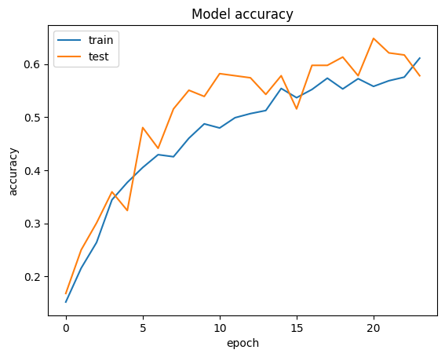
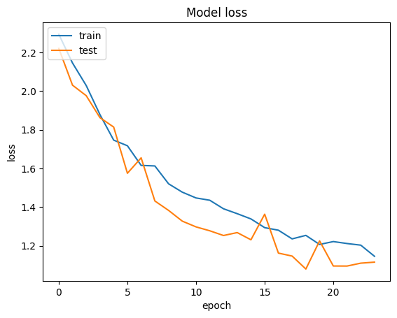

# Monkey Species Classification

[](https://github.com/josetorronteras/Monkey-Species-Classification/actions/workflows/testing.yml)

## Table of contents
- [Quick start](#quick-start)
- [Description](#description)
- [Project Structure](#project-structure)
- [Usage](#usage)
- [Results](#results)

## Quick start
It is necessary to have installed: Python 3.5.2 and download [Monkey Species Dataset](https://www.kaggle.com/slothkong/10-monkey-species) in Input Folder.

The present code has been developed under python3 using Anaconda Notebook. The simplest way to run the program is opening the notebook.

[Monkey Species Classification Notebook Training](./notebooks/Monkey%20species%20classification.ipynb)

## Description
The project consists of a convolutional neural network that classifies 10 different monkey species. The dataset used is the [Monkey Species Dataset](https://www.kaggle.com/slothkong/10-monkey-species) from Kaggle. The model has been trained using the Keras library and the Tensorflow backend. The model has been trained using the Adam optimizer and the categorical crossentropy loss function. The model has been trained for 100 epochs with a batch size of 32.

## Project Structure
```
├── config
│   ├── config.ini
├── input
│   ├── monkey_labels.txt
│   ├── images
├── notebooks
│   ├── Train Model.ipynb
|   ├── Test Model.ipynb
├── source
│   ├── aux_functions.py
│   ├── cnn_model.py
│   ├── get_train_test_data.py
├── logs
````

## Usage
Download the dataset from Kaggle [Link](https://www.kaggle.com/datasets/slothkong/10-monkey-species/download?datasetVersionNumber=2) and put it in the Input folder.
Check the configuration file in the config folder.

```python
python3 -m venv env
source env/bin/activate
pip install -r requirements.txt
open jupyter notebook
```

## Results

